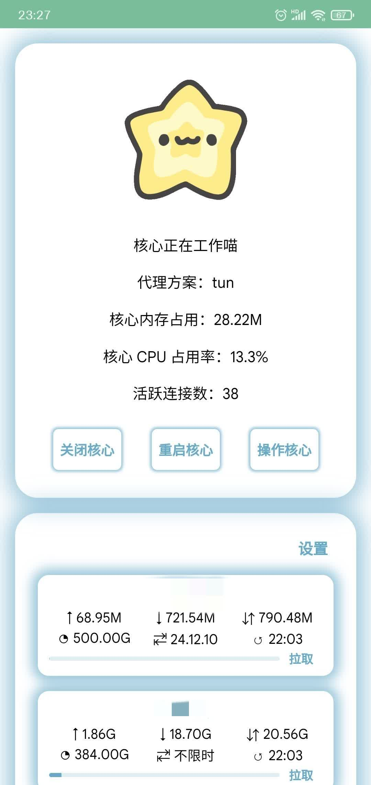
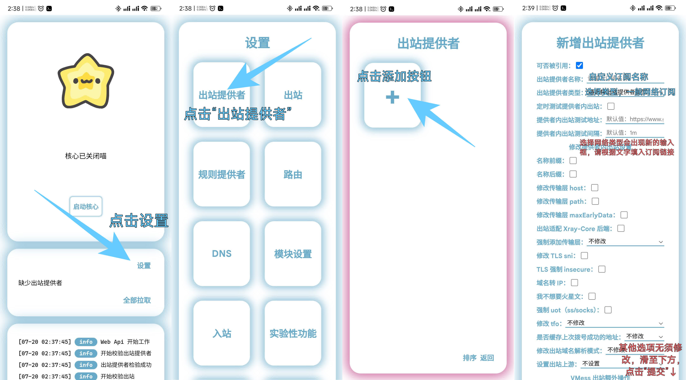
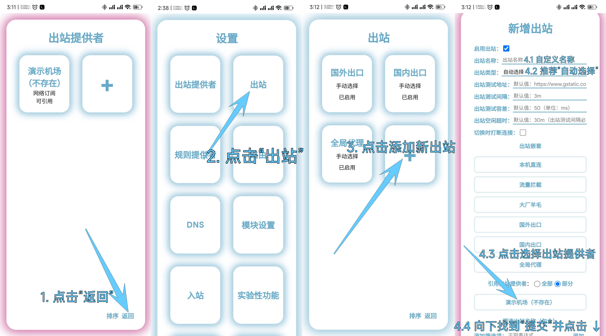
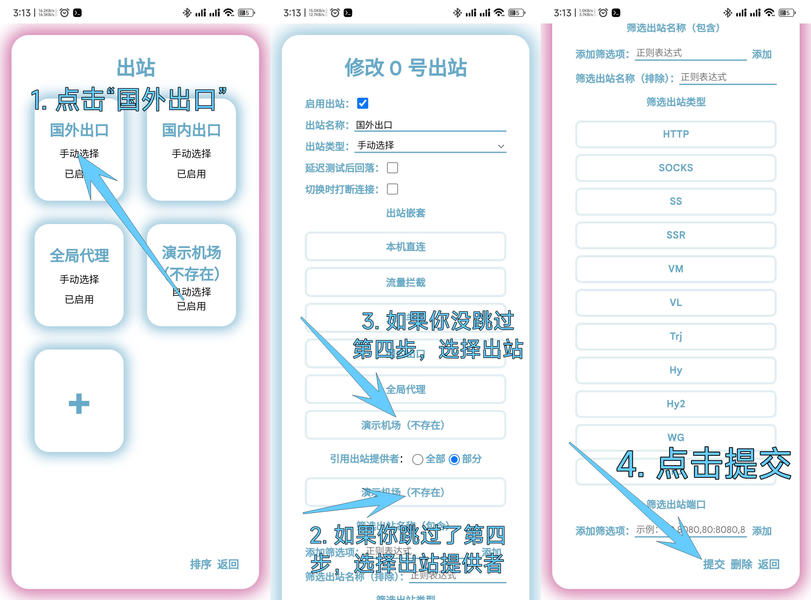
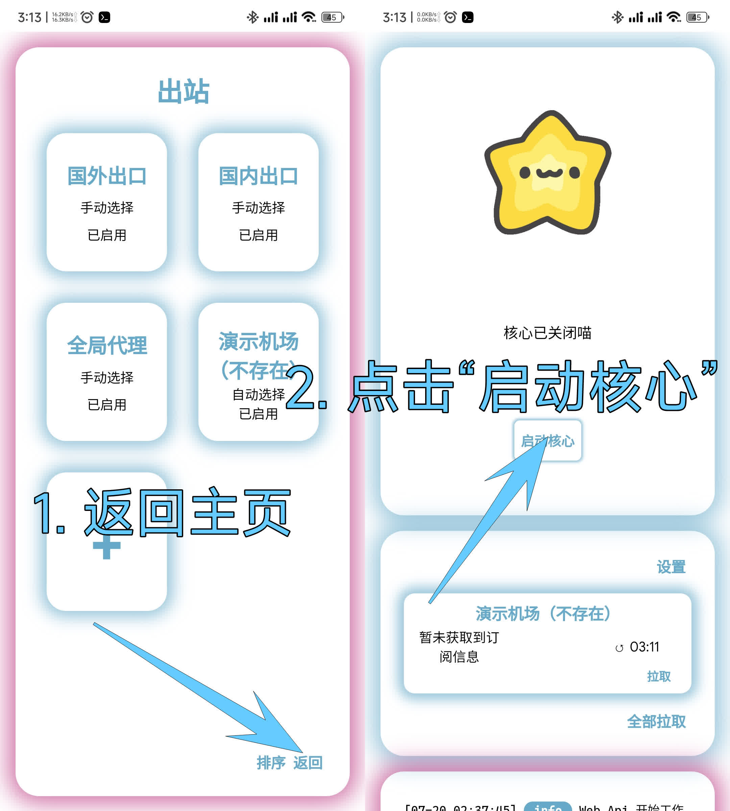

# Configuration example for newbies

## Step 1, open the control panel
The "神秘" App will be installed by default when the 神秘 module is installed. Please open the App to configure the module.

After the panel is opened, the interface is as follows:

Please enter `node` in the input box above. This is your panel password.

The main interface is as follows:

tip: When updating the 神秘 module, the "神秘" data will be automatically cleared to ensure that you use the latest panel.

## Step 2, add subscription
1. Click **设置** to enter the settings page
2. Click **出站提供者** to enter the **Outbound Provider** settings page
3. Then click the add button
4. Enter the information and click **提交** (at the bottom of the page)

## Step 3, add outbound
1. Click **返回** to return to the settings page
2. Click **出站** to enter the **Outbound** settings page
3. Click the Add button to add outbound
4. Enter the information and click **提交** (at the bottom of the page)

tip: This step can be skipped (not recommended)

## Step 4， configure outbound
1. Click **国外出口** to enter the outbound configuration page
2. If you skipped **Step 3**, select **your** Airport Subscription under **引用出站提供者**
3. If you did not skip **Step 3**, select **the outbound you created** in **出站嵌套**
4. Scroll down and click "提交"

## Step 5, start
1. return to home page
2. Click **启动核心**

