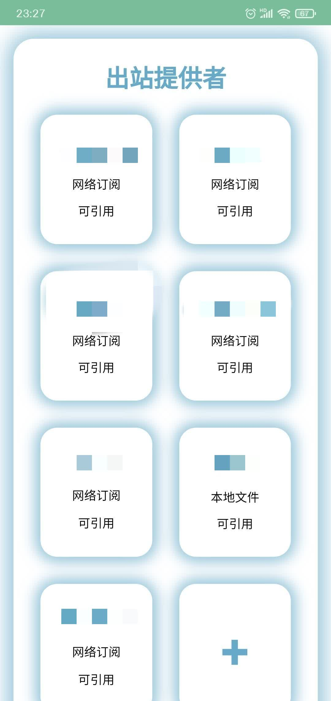

## 选项解释

| 名称 | 解释 |
| :---- | :---- |
| 网络订阅 | 机场网络订阅，从机场服务器获取节点信息 |
| 本地文件 | 本地节点文件，一般用于自建节点，免流。文件存放位置位于 `/data/adb/sfm/src/FileProviders/`，现在已经可以通过面板修改，无需打开目录 |
| 修改文件 | 修改本地节点文件，语法详见[本地节点文件写法](#本地节点文件写法) |
| 订阅链接 | 订阅链接，推荐 Clash 的订阅 |
| 可否被引用 | 是否启用该出站提供者，启用表示使用这个订阅。喵佬原话：“（不启用）是根本不会被加入配置文件” |
| 订阅拉取间隔 | 多久更新一次机场订阅，默认 3600，也就是一个小时 |
| 拉取订阅时查询订阅信息 | 查询机场流量及使用情况 |
| 修改提供者内出站设置 | 下面的都是修改请求的，用于免流，不介绍 |

## 本地节点文件写法
  - 一行一个节点
如：
```
vmess://ew0KICAidiI6ICIyIiwNCiAgInBzIjogIkBTU1JTVUItVjE1LeS7mOi0ueaOqOiNkDpzdW8ueXQvc3Nyc3ViIiwNCiAgImFkZCI6ICJqcDQuYWY0OWM0ZTRjMmVmLnNhbmZlbjAwNC5tZSIsDQogICJwb3J0IjogIjQ0MyIsDQogICJpZCI6ICJjNDg2OGI4YS0xZjVjLTQ1MzYtYjE5MS1kNTQyOWMyZTE0YjciLA0KICAiYWlkIjogIjAiLA0KICAic2N5IjogImF1dG8iLA0KICAibmV0IjogInRjcCIsDQogICJ0eXBlIjogIm5vbmUiLA0KICAiaG9zdCI6ICJqcDQuYWY0OWM0ZTRjMmVmLnNhbmZlbjAwNC5tZSIsDQogICJwYXRoIjogIiIsDQogICJ0bHMiOiAidGxzIiwNCiAgInNuaSI6ICIiLA0KICAiYWxwbiI6ICIiDQp9
vmess://ew0KICAidiI6ICIyIiwNCiAgInBzIjogIkBTU1JTVUItVjE2LeS7mOi0ueaOqOiNkDpzdW8ueXQvc3Nyc3ViIiwNCiAgImFkZCI6ICIxMDQuMjIuNTkuMTk1IiwNCiAgInBvcnQiOiAiNDQzIiwNCiAgImlkIjogImExNTYwYjUyLWI1ODAtNGFhZC1iOGNkLTljZDJlYzUyNjRiNCIsDQogICJhaWQiOiAiMCIsDQogICJzY3kiOiAiYXV0byIsDQogICJuZXQiOiAid3MiLA0KICAidHlwZSI6ICJub25lIiwNCiAgImhvc3QiOiAiMS4yMzkwMDAueHl6IiwNCiAgInBhdGgiOiAiL3ZtZXNzd3MiLA0KICAidGxzIjogInRscyIsDQogICJzbmkiOiAiIiwNCiAgImFscG4iOiAiIg0KfQ==
vmess://ew0KICAidiI6ICIyIiwNCiAgInBzIjogIkBTU1JTVUItVjE3LeS7mOi0ueaOqOiNkDpzdW8ueXQvc3Nyc3ViIiwNCiAgImFkZCI6ICJjZmNkbi5zYW5mZW5jZG4ubmV0IiwNCiAgInBvcnQiOiAiNDQzIiwNCiAgImlkIjogImM0ODY4YjhhLTFmNWMtNDUzNi1iMTkxLWQ1NDI5YzJlMTRiNyIsDQogICJhaWQiOiAiMCIsDQogICJzY3kiOiAiYXV0byIsDQogICJuZXQiOiAid3MiLA0KICAidHlwZSI6ICJub25lIiwNCiAgImhvc3QiOiAidXMxLnNhbmZlbmNkbi5uZXQiLA0KICAicGF0aCI6ICIvemgtY24iLA0KICAidGxzIjogInRscyIsDQogICJzbmkiOiAiIiwNCiAgImFscG4iOiAiIg0KfQ==
```

  - yaml 写法
如：
```yaml
proxies:
  # - {name: 节点名称, type: 协议类型, server: IP地址, port: 端口, udp: 是否是udp底层协议, tls: false, skip-cert-verify: 是否跳过证书验证, headers: {请求头}}
  - {name: 免费节点, type: http, server: 112.47.20.215, port: 443, udp: false, tls: false, skip-cert-verify: false, headers: {}}
```
