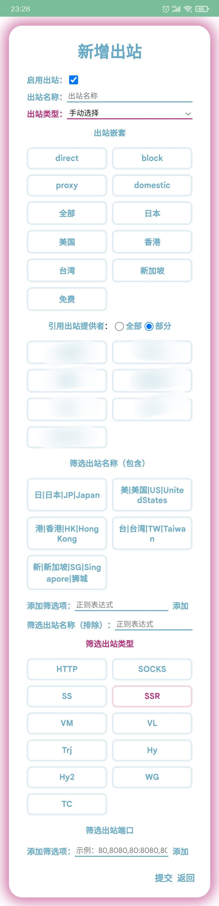

# Outbound

**These three outbound names can be changed, but cannot be deleted! ! ! **

If you modify their names, the rules will be automatically followed, but deleting them will directly change them to **direct**, resulting in the inability to connect to the external network and avoid streaming no matter how configured.

Now their names have been changed,**proxy** changed to **国外出口**，**domestic** changed to **国内出口**，Another **GLOBAL** was changed to **全局代理**.

If you delete it, don’t have internet access, or report an error, don’t ask questions in the group! ! !

## Option explanation
| Option | Explain |
| :---- | :---- |
| 自动选择 | Automatic speed test (urltest), automatically selects the best (lowest latency) node |
| 手动选择 | You choose the node yourself (select) |
| 启用出站 | Whether to use this outbound |
| 出站嵌套 | Include Other Outbound as an outbound provider. Your defaults are only direct (direct connection, not through proxy), block (disconnected, "black hole routing"), 国外出口(proxy), 国内出口(domestic), 全局出口(Global) |
| 出站测试地址 | Speed ​​test link |
| 出站测试间隔 | The time between two speed measurements |
| 出站测试容差 | Speed ​​measurement interval for each node |
| 引用出站提供者 | Which outbound providers to nest. “全部” means nesting all outbound providers, “部分” selects the outbound provider below |
| 筛选出站名称（包含） | As long as the regular expression matches the node |
| 筛选出站名称（排除） | No nodes matched by regular expressions |
| 筛选出站类型 | If you do not select it, then all types (transmission protocols) are selected; if you select one or more, then except for the nodes corresponding to the protocol type you selected, the remaining nodes are discarded and are not included in this outbound |
| 筛选出站端口 | Only nodes with ports within the range, such as 80:8080, means only nodes with ports 80 to 8080, :8080 means ports smaller than 8080 (inclusive) |
