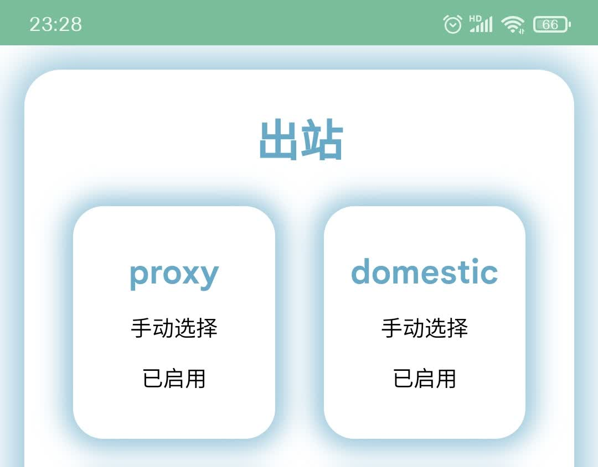
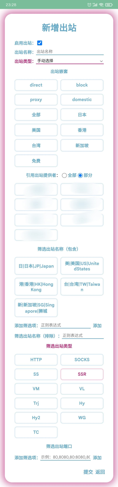

# 出站

**这三个出站的名字可以改，但不能删除！！！**

修改它们的名字，规则会自动尾随，但是删除会直接变成 **direct**，导致不论如何配置都不能连上外网、进行免流。

现在他们的名称已被修改，**proxy** 改为了 **国外出口**，**domestic** 改为了 **国内出口**，另 **GLOBAL** 改为了**全局代理**

如果你删了，没网、报错不要在群里提问！！！

### 选项解释
| 名称 | 解释 |
| :---- | :---- |
| 自动选择 | 自动测速（urltest），自动选择最优（延迟最低）节点 |
| 手动选择 | 你自己选择节点（select） |
| 启用出站 | 是否使用这个出站 |
| 出站嵌套 | 包含其他出站作为出站提供者。你的默认只有 direct（直连，不通过代理）、block（断开，“黑洞路由”）、proxy（代理）、domestic（国内） |
| 出站测试地址 | 测速链接 |
| 出站测试间隔 | 两次测速之间间隔的时间 |
| 出站测试容差 | 每个节点测速间隔 |
| 引用出站提供者 | 嵌套哪些出站提供者。全部表示嵌套所有出站提供者，部分在下方选择出站提供者 |
| 筛选出站名称（包含） | 只要正则表达式匹配到的节点 |
| 筛选出站名称（排除） | 不要正则表达式匹配到的节点 |
| 筛选出站类型 | 如果不选择那么就是选择所有类型（传输协议）；如果选择一个及以上，那么除了你选择的协议类型对应的节点外，其余节点丢弃，不包含在本出站内 |
| 筛选出站端口 | 只要范围内端口的节点，比如 80:8080，表示只要 80 端口到 8080 端口的节点，:8080 表示比 8080 小的端口（包含） |
