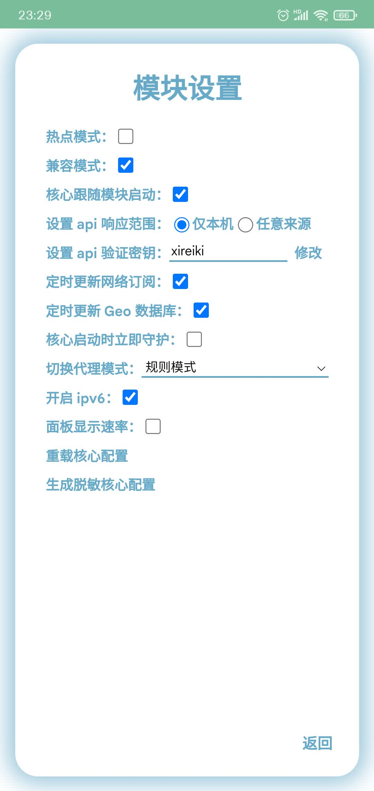

# Module settings

Option explanation:

| Option | Explain |
| :---- | :---- |
| 核心跟随模块启动 | Automatically connect to the agent when booting |
| 设置 api 响应范围 | Only this machine means that “仅本机” can access the panel; “任意来源” means that all devices connected to the hotspot of this device can access the panel and control it. The panel address is the LAN IP of the hotspot machine plus the port number, such as [http://192.168.43.1:23333](http://192.168.43.1:23333) |
| 设置 api 验证密钥 | Password to enter the panel |
| 定时更新网络订阅 | Literally, automatically renew airport subscriptions. After closing, the subscription will not be updated. You need to manually click **Pull** or **Pull All** |
| 定时更新 Geo 数据库 | Literally, it automatically updates the Geo database to more accurately determine whether the traffic needs to go domestic or overseas. |
| 核心启动时立即守护 | Start guarding the core when the core is started, not after the core is started correctly. |
| 切换代理模式 | Mysterious traffic processing mode, with rule mode, automatically determines traffic direction through preset rules; global proxy, all traffic goes abroad; global direct connection, all traffic goes domestic |
| 开启 ipv6 | Enable IPv6 |
| 面板显示速率 | Display current upload and download speeds on the home page |
| 使用 yard（不推荐） | Using the yard panel, after opening it, the core of the operation is no longer mysterious, but yard. If you do not open this option, you can also access [yard](http://localhost:9909/ui/?hostname=127.0.0.1&port=9909&secret=singBox) |
| 生成脱敏核心配置 | Generate baseConfig.yaml file for sharing assistance shareBaseConfig.yaml |
