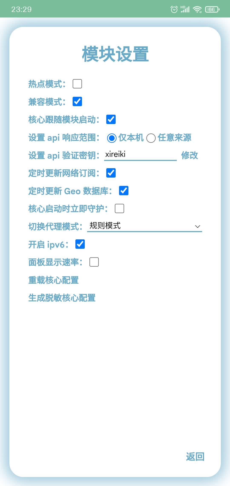

# 模块设置

选项解释：

| 名称 | 解释 |
| :---- | :---- |
| 核心跟随模块启动 | 开机就自动连上代理 |
| 设置 api 响应范围 | 仅本机表示只有本机能访问面板；任意来源表示所有连接上这台设备的热点的设备都能访问面板并操控它。面板地址是热点机的局域网 IP 加端口号，比如 [http://192.168.43.1:23333](http://192.168.43.1:23333) |
| 设置 api 验证密钥 | 进入面板的密码 |
| 定时更新网络订阅 | 字面意思，自动更新机场订阅。关闭之后不会再更新订阅，需要你手动点击**更新**或者**全部施法** |
| 定时更新 Geo 数据库 | 字面意思，自动更新 Geo 数据库，用来更准确的判断流量是需要走国内还是走国外 |
| 核心启动时立即守护 | 启动核心就开始守护核心，而不是核心正确启动后 |
| 切换代理模式 | 神秘的流量处理模式，有规则模式，通过预设的规则自动判断流量走向；全局代理，所有流量都走国外；全局直连，所有流量都走国内 |
| 开启 ipv6 | 字面意思 |
| 面板显示速率 | 在主页显示当前的上传和下载的速度 |
| 使用 yard（不推荐） | 使用 yard 面板，打开后操作核心不再是神秘，而是 yard，不打开这个选项，也可以通过链接访问 [yard](http://localhost:9909/ui/?hostname=127.0.0.1&port=9909&secret=singBox) |
| 生成脱敏核心配置 | 生成用于分享求助的 baseConfig.yaml 文件 shareBaseConfig.yaml |
