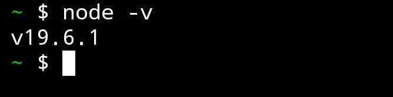
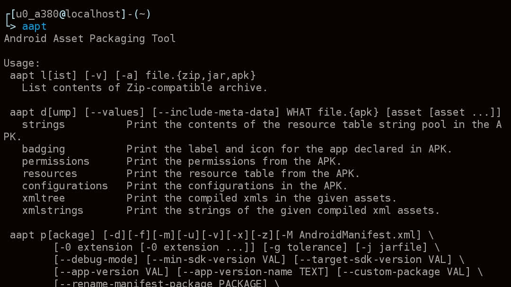

## 安装 [Termux](https://github.com/termux/termux-app/releases) 应用
Termux 有两个发布渠道，[Github](https://github.com/termux/termux-app/releases) 和 [F-Droid](https://f-droid.org/packages/com.termux/)，小白建议下载 [F-Droid](https://f-droid.org/packages/com.termux/) 的版本（点击文字前往对应下载渠道）

Tip: 如果你不想进行这一步，可以使用[我的修改版](https://t.me/xiayinlily)(NoTermux)，它去除了环境依赖。

## 安装 nodejs 和 aapt（电脑版请查看 README.md）
打开 Termux，依次执行以下命令，我会一条条讲解。

事先声明：**由于官方源较慢，请酌情考虑挂梯子执行！**

Tip: 也可以自己搜索换源方法（不建议）。

这条命令用于更新目前 Termux 中的所有软件包，在安装过程中如果卡住不动了，请使用输入法，输入一个小写 `y` 并回车：
```bash
pkg up -y
```

最后一步，安装 nodejs 和 aapt
```bash
pkg in nodejs aapt -y
```

检查 nodejs 是否安装，如图所示即为安装成功
```bash
node -v
```



这张图来自: [神秘模块入门教程（安卓端）](https://telegra.ph/%E7%A5%9E%E7%A7%98%E6%A8%A1%E5%9D%97%E7%AE%80%E6%98%8E%E6%95%99%E7%A8%8BAndroid%E7%AB%AF-04-06)

检查 aapt 是否安装成功，如图输出一大堆文字即为成功。
```bash
aapt
```



如果在安装模块时提示 **aapt 环境损坏** 请执行 `pkg uninstall aapt` 卸载 **aapt** 后执行 `pkg up && pkg in aapt` 以重新安装 **aapt**。

如果在安装模块时提示 **node 环境损坏** 请执行 `pkg uninstall nodejs` 卸载 **nodejs** 后执行 `pkg up && pkg in nodejs` 以重新安装 **nodejs**。